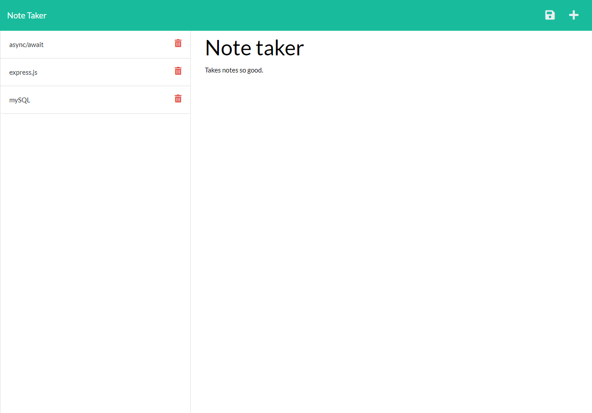

# Easy-Note-Taker
### The most fun you'll have creating notes for later!

**Version 1.0**

## Note 
You are important.

## Installation Instructions

Before running this program:
1) Clone repository
2) Run "npm init -y" in your command line.
3) Run "npm install" in your command line.
4) Run "npm start" or "node server.js" in your command line.
5) Go to http://localhost:3001 in your browser.
6) Enjoy making notes.

## Acceptance Criteria
Students have completed this project when:

```md
GIVEN a note-taking application
WHEN I open the Note Taker
THEN I am presented with a landing page with a link to a notes page
WHEN I click on the link to the notes page
THEN I am presented with a page with existing notes listed in the left-hand column, plus empty fields to enter a new note title and the note’s text in the right-hand column
WHEN I enter a new note title and the note’s text
THEN a Save icon appears in the navigation at the top of the page
WHEN I click on the Save icon
THEN the new note I have entered is saved and appears in the left-hand column with the other existing notes
WHEN I click on an existing note in the list in the left-hand column
THEN that note appears in the right-hand column
WHEN I click on the Write icon in the navigation at the top of the page
THEN I am presented with empty fields to enter a new note title and the note’s text in the right-hand column
```


## Media




## Links
* [Deployed Website Link](https://andrewt11.github.io/Easy-Note-Taker/)
* [Code Repository Link](https://github.com/AndrewT11/Easy-Note-Taker/)

## Credits
* Andrew Tran
* Chris Stallcup
* Traversy Media
* Web Dev Simplified


### Resources

* https://www.w3schools.com/
* https://developer.mozilla.org/en-US/
* https://www.stackoverflow.com
* https://scotch.io/tutorials/keeping-api-routing-clean-using-express-routers


### License
Copyright (c) [2021] [Andrew Tran]

Permission is hereby granted, free of charge, to any person obtaining a copy
of this software and associated documentation files (the "Software"), to deal
in the Software without restriction, including without limitation the rights
to use, copy, modify, merge, publish, distribute, sublicense, and/or sell
copies of the Software, and to permit persons to whom the Software is
furnished to do so, subject to the following conditions:

The above copyright notice and this permission notice shall be included in all
copies or substantial portions of the Software.

THE SOFTWARE IS PROVIDED "AS IS", WITHOUT WARRANTY OF ANY KIND, EXPRESS OR
IMPLIED, INCLUDING BUT NOT LIMITED TO THE WARRANTIES OF MERCHANTABILITY,
FITNESS FOR A PARTICULAR PURPOSE AND NONINFRINGEMENT. IN NO EVENT SHALL THE
AUTHORS OR COPYRIGHT HOLDERS BE LIABLE FOR ANY CLAIM, DAMAGES OR OTHER
LIABILITY, WHETHER IN AN ACTION OF CONTRACT, TORT OR OTHERWISE, ARISING FROM,
OUT OF OR IN CONNECTION WITH THE SOFTWARE OR THE USE OR OTHER DEALINGS IN THE
SOFTWARE.
